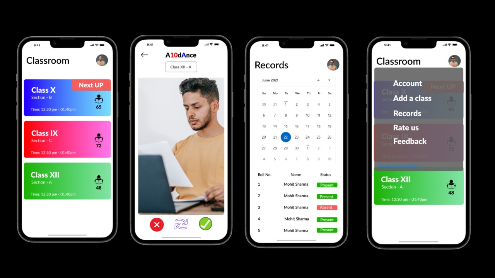

# Sample README

- A10Der Android Application
This is an attendance tracking app designed to track attendance of users with the help of left/right swipe.

Here is a picture to help you imagine what the app would look, feel and deliver like.

### For first time Contributors

First time contributors can read [CONTRIBUTING.md](/CONTRIBUTING.md) file for help regarding creating issues and sending pull requests.

### Branch Policy

We have the following branches

 * **development** All development goes on in this branch. If you're making a contribution, you are supposed to make a pull request to _development_. PRs to development branch must pass review from a maintainer and fulfill all code changes requested by maintainers.
 * **master** This contains shipped code. After significant features/bugfixes are accumulated on development, we make a version update and make a release.

### Join the development

* Before you join development, please set up the project on your local machine, run it and go through the application completely. We suggest you explore the app to your best potential and try to get comfortable and have a clear understanding of what is happening where and where are the different components located.
* If you would like to work on an issue, drop in a comment at the issue. If it is already assigned to someone, but there is no sign of any work being done, please feel free to reach out to the maintainers.

## License

This project is currently licensed under the Apache License Version 2.0. A copy of [LICENSE](LICENSE) should be present along with the source code.
